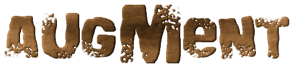

Image Data Augmentation for Deep Learning

---

## Building
- [Requirements](docs/requirements.md)
```
git clone https://github.com/akhud78/augment.git
cd augment
git checkout develop

mkdir build
cd build
cmake ..
make
```
## Install
```
sudo make install
```
## Remove
```
sudo rm /usr/local/bin/augment
```
## Usage
- [Examples](docs/examples.md)
- [Tests](docs/tests.md)
